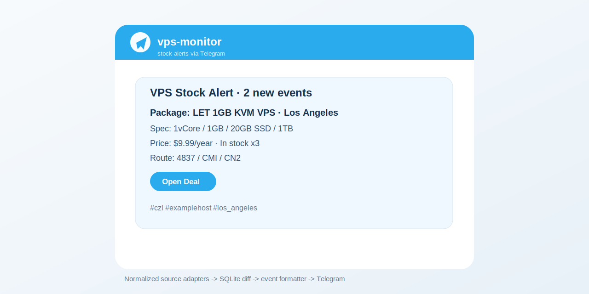

# vps-monitor

[](https://github.com/shali10/vps-monitor/actions/workflows/test.yml)
[](pyproject.toml)
[](LICENSE)
[](https://github.com/shali10/vps-monitor/releases)

面向低价 VPS 库存的事件驱动监控工具。它会从不同商家接口拉取套餐，统一成标准库存模型，按规则筛选，再把新增/补货事件推送到 Telegram。

当前 v4 版本已经在生产环境使用，核心目标不是“扫全网”，而是稳定盯住少数高价值来源，避免重复推送、脏数据和无意义摘要。



## 目录

| 章节 | 内容 |
|---|---|
| [适合谁](#适合谁) | 使用边界 |
| [功能](#功能) | 核心能力 |
| [快速开始](#快速开始) | 本地安装和 dry-run |
| [配置文件](#配置文件) | 配置结构 |
| [命令速查](#命令速查) | 常用命令 |
| [运行模型](#运行模型) | 架构流程 |
| [systemd 部署](#systemd-部署) | 生产部署 |
| [内置来源](#内置来源) | czl / 独角鲸云说明 |
| [项目成熟度](#项目成熟度) | OSS 就绪度 |
| [安全边界](#安全边界) | token 和状态文件处理 |

## 适合谁

| 场景 | 是否适合 |
|---|---|
| 盯 VPS 商家库存、补货、低价套餐 | 适合 |
| 需要 Telegram 直链推送 | 适合 |
| 多商家规则不同，但希望统一输出格式 | 适合 |
| 希望 systemd timer 稳定周期运行 | 适合 |
| 想做全自动购买/抢购 | 不适合，项目只监控和通知 |
| 想抓取所有 VPS 网站 | 不适合，需要自己写 source adapter |

## 功能

| 能力 | 说明 |
|---|---|
| 多来源适配 | 内置 `dujiaojing`、`czl` 两个来源 |
| 标准模型 | 不同接口统一为 `Offer / Price / Event` |
| 规则筛选 | 支持价格、内存、CPU、关键词、套餐池规则 |
| SQLite 状态 | 记录历史库存，避免每轮重复推送 |
| Telegram 推送 | HTML 消息、购买直链、自动分页 |
| dry-run | 默认不发送，可先预览消息 |
| systemd timer | 推荐用 oneshot service + timer 周期运行 |
| CI / 测试 | GitHub Actions + pytest + 语法检查 |
| 项目治理 | Issue 模板、Dependabot、SECURITY、Release checklist |

## 快速开始

```bash
git clone https://github.com/shali10/vps-monitor.git
cd vps-monitor
python3 -m venv .venv
. .venv/bin/activate
pip install -e .
cp .env.example .env
cp config.example.json config.local.json
```

编辑 `.env`：

```bash
TELEGRAM_BOT_TOKEN=replace-with-your-telegram-bot-token
TELEGRAM_CHAT_IDS=123456789
SITE_A_TOKEN=replace-with-your-dujiaojing-token
```

先 dry-run，不会发送消息：

```bash
vpsmon-v4 --config config.local.json --source czl --notify-first-run --dry-run
vpsmon-v4 --config config.local.json --source dujiaojing --notify-first-run --dry-run
```

确认输出没问题后再发送：

```bash
vpsmon-v4 --config config.local.json --source czl --send
vpsmon-v4 --config config.local.json --source dujiaojing --send
```

## 配置文件

仓库只提交 `config.example.json`。生产或本地配置请复制成 `config.local.json` 或 `/opt/vps-monitor/config.json`，这两个名字已被 `.gitignore` 排除。

| 配置段 | 用途 |
|---|---|
| `sources` | 商家接口、分页、购买链接模板、token 环境变量名 |
| `rules.global` | 全局排除关键词，例如独立服务器类套餐 |
| `rules.<source>` | 单来源筛选规则和套餐池规则 |
| `notify_policy` | 推送数量限制和排序策略 |
| `telegram` | Telegram bot token / chat ids 的环境变量名 |
| `state_db` | SQLite 状态库路径 |

更多细节见 [docs/CONFIGURATION.md](docs/CONFIGURATION.md)。

## 命令速查

| 命令 | 作用 |
|---|---|
| `make install` | 安装本地开发依赖 |
| `make check` | 语法、测试、敏感文件扫描 |
| `make dry-run-czl` | 预览 czl.net 推送 |
| `make dry-run-dujiaojing` | 预览独角鲸云推送 |
| `vpsmon-v4 --config config.local.json --source czl --dry-run` | 预览 czl.net 推送 |
| `vpsmon-v4 --config config.local.json --source dujiaojing --dry-run` | 预览独角鲸云推送 |
| `vpsmon-v4 --config config.local.json --source czl --send` | 实际发送 czl.net 事件 |
| `vpsmon-v4 --config config.local.json --source czl --summary --send` | 只发送摘要 |
| `vpsmon-v4 --config config.local.json --source czl --limit-events 10 --sort-events price` | 按价格排序并限制数量 |

## 运行模型

```text
systemd timer
  -> python3 -m vpsmon.cli --source <source>
      -> source adapter 拉取原始数据
      -> normalize 成 Offer
      -> rules 过滤
      -> SQLite diff 生成事件
      -> Telegram formatter 渲染并发送
```

service 是 oneshot 作业，跑完显示 `inactive (dead)` 是正常的。判断健康状态时看 `Result=success` 和 `ExecMainStatus=0`，不要把它当常驻进程。

## systemd 部署

仓库带了示例 unit：

| 文件 | 默认用途 |
|---|---|
| `systemd/vps-monitor-v4-czl.service` | czl.net 单次检查 |
| `systemd/vps-monitor-v4-czl.timer` | czl.net 周期触发 |
| `systemd/vps-monitor-v4-dujiaojing.service` | 独角鲸云单次检查 |
| `systemd/vps-monitor-v4-dujiaojing.timer` | 独角鲸云周期触发 |

部署前先看 unit 里的路径是否符合你的机器。默认按 `/opt/vps-monitor` 设计。

```bash
sudo mkdir -p /opt/vps-monitor
sudo rsync -a --delete ./ /opt/vps-monitor/
sudo cp systemd/vps-monitor-v4-*.service systemd/vps-monitor-v4-*.timer /etc/systemd/system/
sudo systemctl daemon-reload
sudo systemctl enable --now vps-monitor-v4-czl.timer vps-monitor-v4-dujiaojing.timer
```

安装细节见 [docs/INSTALL.md](docs/INSTALL.md)。

## 内置来源

| 来源 | 认证 | 文档 | 典型用途 |
|---|---|---|---|
| `czl` | 无 token，公开接口 | [docs/sites/czl.md](docs/sites/czl.md) | 低价 VPS 公开库存筛选 |
| `dujiaojing` | `SITE_A_TOKEN` | [docs/sites/dujiaojing.md](docs/sites/dujiaojing.md) | 独角鲸云库存与补货提醒 |

## 目录结构

| 路径 | 说明 |
|---|---|
| `vpsmon/cli.py` | CLI 入口和单轮执行流程 |
| `vpsmon/sources/` | 来源适配器 |
| `vpsmon/rules/` | 解析和筛选规则 |
| `vpsmon/engine/diff.py` | 状态对比和事件生成 |
| `vpsmon/storage/sqlite.py` | SQLite 状态存储 |
| `vpsmon/notifiers/telegram.py` | Telegram 消息渲染和发送 |
| `systemd/` | systemd service/timer 示例 |
| `tests/` | 单元测试 |
| `docs/` | 安装、配置、架构、排错文档 |
| `.github/` | CI、Dependabot、Issue 模板 |

## 新增来源

新增商家不需要改推送层，推荐流程：

| 步骤 | 要做的事 |
|---|---|
| 1 | 在 `vpsmon/sources/<name>.py` 实现 fetch 和 normalize |
| 2 | 把原始套餐转换成 `Offer` |
| 3 | 在 `vpsmon/cli.py` 的 `_build_source()` 注册来源名 |
| 4 | 在 `config.example.json` 添加配置模板和规则 |
| 5 | 给解析、筛选、格式化补测试 |
| 6 | 在 `docs/sites/` 补来源文档 |

具体说明见 [docs/ARCHITECTURE.md](docs/ARCHITECTURE.md)。

## 项目成熟度

| 维度 | 当前状态 | 说明 |
|---|---|---|
| 代码结构 | A | package 化、source adapter、SQLite 状态、统一 formatter |
| 文档 | A | README、安装、配置、架构、排错、站点文档齐全 |
| 测试 | A | 解析/格式化/发送路径、SQLite diff 生命周期、事件落库、池规则、脱敏 API fixture 驱动的 source fetch 均有覆盖 |
| CI/CD | A- | GitHub Actions、Dependabot 已接入 |
| OSS 规范 | A | LICENSE、CHANGELOG、SECURITY、Issue 模板、Release checklist |
| 安全 | A- | token 环境变量化、敏感文件忽略、make check 扫描 |
| 可发现性 | B+ | topics/社区传播仍需后续在 GitHub 页面配置 |
| 使用体验 | A- | CLI、Makefile、systemd 示例、dry-run 流程完整 |

## 安全边界

| 项 | 处理方式 |
|---|---|
| Bot token | 只放 `.env`，不写进 config |
| 商家 token | 通过环境变量读取 |
| SQLite state | 不提交到 Git |
| 真实生产配置 | 不提交到 Git |
| 日志 | 不提交到 Git |
| 安全报告 | 走 [SECURITY.md](SECURITY.md) |

## 开发验证

```bash
make check
python3 -m vpsmon.cli --config config.example.json --source czl --notify-first-run --dry-run
```

## 版本

当前版本：`v4.4.0`。

更新记录见 [CHANGELOG.md](CHANGELOG.md)。

## License

MIT License。见 [LICENSE](LICENSE)。
